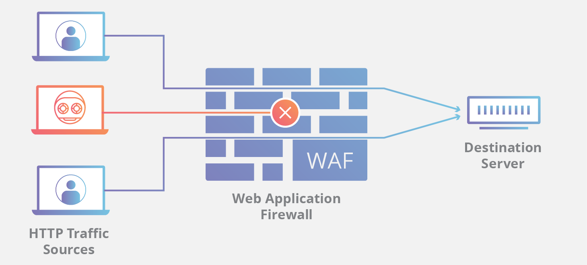

- [x] 1. [Quais são os três pilares da segurança da informação? Qual a importância de cada um? Seja detalhista.]([#Quais-são-os-três-pilares-da-segurança-da-informação)
- [x] 2. [[#O que é não repúdio? Qual sua importância para segurança da informação?]] 
- [x] 3. [[#O que é MFA? Qual sua utilidade para segurança da informação?]]
- [x] 4. [[#O que é um ataque DDoS? Cite um exemplo real.]]
- [x] 5. [[#O que é uma vulnerabilidade zero-day? Qual seu impacto na segurança da informação?]]
- [x] 6. [[#Aponte a principal característica ou a diferença de:]]
- [x] 7. [[#O que é engenharia social? Cite 03 técnicas de engenharia social.]]
- [x] 8. [[#Qual a diferença entre um spam, um phishing e um spear phishing?]]
- [ ] 9. [[#Descreva como um atacante poderia levantar informações para lançar um spear phishing em uma grande empresa listada na bolsa de valores.]]
- [x] 10. [[#Explique brevemente as seguintes normas:]]
- [x] 11. [[#Quais são as fases do ciclo de resposta a incidentes de acordo com o NIST 800-61 REV 2?]]
- [ ] 12. [[#Descreva o que é o CIS Controls v8.]]
- [ ] 13.  [[#Explique o que é o NIST CSF.]]
- [ ] 14. [[#Explique o que é o PMBOK e cite quais são os macroprocessos de gerenciamento de projetos.]]
- [x] 15. [[#Explique o que é um ativo, uma vulnerabilidade e uma ameaça. Relacione os três em um exemplo.]]
- [ ] 16. [[#Explique o que é um APT e cite um exemplo real.]]
- [x] 17. [[#Quais são os fatores de autenticação? Cite exemplos reais de sua utilização.]]
- [ ] 18. [[#Aponte as diferenças entre os protocolos TCP e UDP. Depois aponte 02 casos de uso para cada um dos protocolos.]]
- [ ] 19. [[#Cite um exemplo de um ator de ameaça sofisticado e um simples. Explique a natureza da sofisticação.]]
- [ ] 20.  [[#O que é o OWASP TOP 10? Cite pelo menos 02 itens presentes no OWASP TOP 10.]]
- [ ] 21. [[#O que é um SGSI? Aponte qual norma exige sua elaboração.]]
- [ ] 22. [[#O que são NIST e SANS? Qual relevância para comunidade de segurança da informação? Cite pelo menos um exemplo de trabalho de cada um.]]
- [ ] 23.
- [ ] 24.
- [ ] 25.
- [ ] 26.
- [ ] 27.
- [ ] 28.
- [ ] 29.
- [ ] 30.
- [ ] 31.
- [ ] 32.
- [ ] 33.
- [ ] 34.
- [ ] 35.
- [x] 36. [[#O que é um WAF? Qual sua principal função?]]
- [x] 37. [[#O que é um SIEM? Qual sua principal função?]]
- [x] 38. [[#Explique para que serve e como funciona uma DMZ.]]
- [ ] 39.
- [ ] 40.
- [ ] 41.
- [ ] 42.
- [ ] 43.
- [ ] 44.
- [ ] 45.
- [ ] 46.
- [ ] 47.
- [ ] 48.
- [ ] 49.
- [ ] 50.
- [ ] 51.
- [ ] 52.

# Perguntas

### Quais são os três pilares da segurança da informação? Qual a importância de cada um? Seja detalhista.

- Confidencialidade - garantir que uma determinada informação ou dado seja disponibilizado exclusivamente para quem tem autorização para tal.
Exemplos de quebra de confidencialidade: escalonamento de privilégios e quebra de senhas.

- Integridade - garantir que as informações estejam conforme foram estabelecidas e, caso haja modificação, tenha ocorrido de forma autorizada.
Exemplo de quebra de integridade: técnica Man-in-the-middle onde o atacante intercepta o tráfego de rede, ficando no meio da comunicação e monitorando tudo o que está acontecendo.

- Disponibilidade - garantir acesso confiável à informação sempre que necessário
Exemplo de quebra de disponibilidade: ataque DDoS (Negação de Serviço), onde ocorre um bombardeamento em um sistema com uma quantidade esmagadora de tráfego fazendo com que o mesmo fique indisponível.

### O que é não repúdio? Qual sua importância para segurança da informação?

Incapacidade de alguém negar a realização de uma ação verdadeira, confirmada por registros, como por exemplo assinatura digital ou logs. Importante pois previne que alguma das partes negue ou conteste uma transação após ela ser realizada, sendo uma evidência suficiente para ser utilizada perante a autoridade legal.

### O que é MFA? Qual sua utilidade para segurança da informação?

Autenticação Multifator. Garantir a autenticação de uma tentativa de acesso utilizando-se mais de um fator em conjunto, que pode ser algo que o usuário conheça (ex: senha), algo que o usuário tenha (ex: token) ou algo que o usuário seja (ex: biometria). Porém, dois métodos iguais não garantem a MFA.

### O que é um ataque DDoS? Cite um exemplo real.

O ataque de negação de serviço distribuído (DDoS) é executado a partir de diversas fontes coordenadas que resulta em algum tipo de interrupção de serviço aos usuários, dispositivos ou aplicações.

Um exemplo real foi o ataque sofrido pela AWS em fevereiro de 2020 onde em seu ápice, o ataque disparou um tráfego de entrada a uma taxa de 2,3 terabits por segundo (Tbps). A AWS não divulgou a qual cliente o ataque foi direcionado.

### O que é uma vulnerabilidade zero-day? Qual seu impacto na segurança da informação?

São vulnerabilidades até então desconhecidas pelos fornecedores e, portanto, sem proteção adequada. Durante o tempo que os fornecedores de software demoram para desenvolver e liberar um patch, a rede está vulnerável a essas explorações. 

### Aponte a principal característica ou a diferença de:  
  
- **Malware**  - termo usado para descrever o software desenvolvido para interromper as operações do computador ou obter acesso a sistemas informatizados, sem o conhecimento ou permissão do usuário.
- **Ransomware**  - aprisiona um sistema de computador ou os dados nele encontrados até que a vítima faça um pagamento. Funciona criptografando os dados no computador com uma chave desconhecida ao usuário.
- **Vírus**  - é um código malicioso executável que está anexado a outro arquivo executável, como um programa legítimo. A maioria dos vírus necessitam de inicialização do usuário final.
- **Worm**  - semelhantes ao vírus, podem ser executados de modo autônomo. Exceto pela infecção inicial, os worms não necessitam mais da participação do usuário.
- **Spyware** - é o software que permite que um criminoso obtenha informações sobre as atividades do computador do usuário.
- **Key logger** - registro de pressionamento de teclas em um teclado, geralmente sem a permissão ou o conhecimento do usuário.

### O que é engenharia social? Cite 03 técnicas de engenharia social.

Engenharia social é um meio totalmente não técnico de um criminoso coletar informações sobre a vítima. Engenharia social é um ataque que tenta manipular indivíduos para realizar ações ou divulgar informações confidenciais.

**Pretexting** - Ocorre quando um invasor chama uma pessoa e mente para ela na tentativa de obter acesso a dados confidenciais. Um exemplo envolve um invasor que finge precisar de dados pessoais ou financeiros para confirmar a identidade do destinatário.

**Something for Something (Quid pro quo)** - Ocorre quando um invasor solicita informações pessoais de uma pessoa em troca de algo, como um presente.

**Baiting** - Se utiliza da curiosidade humana ao deixar algum dispositivo externo infectado em uma mesa ou até mesmo distribuí-lo gratuitamente, o criminoso espera que os curiosos de plantão abram o dispositivo e executem arquivos, podendo infectar máquinas e possivelmente a rede corporativa.

### Qual a diferença entre um spam, um phishing e um spear phishing?

Spam é um email indesejado, não solicitado, mas sem carga maliciosa, enquanto que um phishing ocorre quando uma parte mal-intencionada envia um e-mail fraudulento disfarçado de uma fonte legítima e confiável. Já o Spear phishing é um ataque de phishing altamente direcionado, personalizado para uma pessoa específica.

### Descreva como um atacante poderia levantar informações para lançar um spear phishing em uma grande empresa listada na bolsa de valores.

### Explique brevemente as seguintes normas:  
-  BACEN 4658/4893
- LGPD/GDPR  
- PCI:DSS  
- SOX  
- ISO 27001

**BACEN 4658/4893**

A Resolução **BACEN 4658** entrou em vigor no dia 26 de abril de 2018, por decisão do Banco Central do Brasil. Ela estabelece as exigências para as instituições financeiras e quaisquer outras empresas autorizadas a funcionar pelo Bacen quanto a seus ambientes de tecnologia contra ataques cibernéticos.

E não são apenas as instituições financeiras que devem seguir a 4658 — ela também vale para quaisquer prestadores de serviços que manipulem dados, informações sensíveis ou informações relevantes para o andamento das atividades operacionais das empresas regulamentadas pelo Banco Central.

A Resolução **BACEN 4893/2021**, publicada em 26 de fevereiro de 2021, define sobre a Política de Segurança Cibernética e sobre os requisitos para a contratação de serviços de processamento e armazenamento de dados e de computação em nuvem a serem observados pelas instituições autorizadas a funcionar pelo Banco Central do Brasil. As Empresas cadastradas como Instituições Financeiras junto ao Bacen devem estabelecer plano de ação e de resposta a incidentes

**PCI DSS**

O padrão de segurança de dados do setor de cartões de pagamento (PCI DSS) é um conjunto de regras contratuais que regem como proteger dados de cartão de crédito, à medida que comerciantes e bancos fazem a transação. O PCI DSS é um padrão voluntário (em teoria) e comerciantes/fornecedores podem escolher se desejam cumprir o padrão. No entanto, a não conformidade do fornecedor pode resultar em taxas de transações significativamente maiores, multas de até US $500.000 e, possivelmente, até mesmo na perda da capacidade de processar cartões de crédito.

Governado pelo Conselho de Padrões de Segurança da Indústria de Cartões de Pagamento (PCI SSC), o esquema de conformidade visa proteger transações de cartão de crédito e débito contra roubo de dados e fraude.

A certificação PCI garante a segurança dos dados dos cartões de sua empresa por meio de um conjunto de requisitos estabelecidos pelo PCI SSC. Isso inclui várias práticas recomendadas comumente conhecidas, como:

-   Instalação de firewall
-   Criptografia de transmissões de dados
-   Uso de software antivírus

Além disso, as empresas devem restringir o acesso aos dados do titular do cartão e monitorar o acesso aos recursos da rede.

A conformidade com o PCI  é dividida em quatro níveis, com base no número anual de transações de cartão de crédito ou débito que uma empresa processa. O nível de classificação determina o que uma empresa precisa fazer para permanecer em conformidade.

**Sarbanes-Oxley Act (SOX)**

Depois de vários escândalos de contabilidade nos EUA, o congresso aprovou a Lei Sarbanes-Oxley (SOX). A finalidade da SOX foi para reformular os padrões de contabilidade financeira e empresarial e foi direcionada especificamente aos padrões das empresas de capital aberto nos Estados Unidos.

**ISO 27001**

Os padrões ISO 27000 descrevem a implementação de um sistema de gerenciamento de segurança da informação abrangente (ISMS). Um ISMS consiste em todos os controles administrativos, técnicos e operacionais para manter a informação segura dentro de uma empresa.

ISO 27001 define objetivos do controle de gerenciamento de segurança da informação, em doze domínios.  Esses doze domínios servem para organizar, em alto nível, as vastas áreas de informações cobertas pela segurança da informação.

### Quais são as fases do ciclo de resposta a incidentes de acordo com o NIST 800-61 REV 2?

- Fase 1: Preparação

- Fase 2: Detecção e Análise

A detecção começa quando é descoberto o incidente. A detecção adequada inclui como o incidente ocorreu, quais dados estavam envolvidos e quais sistemas estavam envolvidos. A análise de incidente ajuda a identificar a origem, extensão, impacto e detalhes de uma violação de dados.

- Fase 3: Contenção, erradicação e recuperação

Os esforços de contenção incluem ações imediatas realizadas, como desconectar um sistema da rede para parar o vazamento de informações.

Depois de identificar a violação, a empresa precisa contê-la e erradicá-la. Isso pode exigir período de inatividade adicional para os sistemas. A fase de recuperação inclui as medidas que a empresa precisa tomar para resolver a violação e restaurar os sistemas envolvidos. Depois da solução, a empresa precisa restaurar todos os sistemas ao seu estado original, antes da violação.

- Fase 4: Atividade pós incidente

Depois de restaurar todas as operações a um estado normal, a empresa deve examinar a causa do incidente. Um exame das lições aprendidas pode ajudar a empresa a se preparar melhor, melhorando o plano de resposta a incidente.

Para mais informações: https://nvlpubs.nist.gov/nistpubs/SpecialPublications/NIST.SP.800-61r2.pdf

### Descreva o que é o CIS Controls v8.

### Explique o que é o NIST CSF.

### Explique o que é o PMBOK e cite quais são os macroprocessos de gerenciamento de projetos.

### Explique o que é um ativo, uma vulnerabilidade e uma ameaça. Relacione os três em um exemplo.

Vulnerabilidade é uma fraqueza que torna um alvo suscetível ao ataque, ameaça é qualquer circunstância ou evento com potencial para impactar de maneira prejudicial e, ativo é algo de valor que necessita de proteção. 

Exemplos:

1. Um sistema operacional desatualizado (vulnerabilidade) instalado em um computador da empresa contendo dados sigilosos (ativo) que pode ser explorado em um ataque (ameaça) exploit.

2. Acesso em rede pública (vulnerabilidade) com telefone celular, sem medidas de proteção podendo ser interceptado por um man-in-the-mobile (ameaça) e ter dados (ativo) vazados.

### Explique o que é um APT e cite um exemplo real.

### Quais são os fatores de autenticação? Cite exemplos reais de sua utilização.

Algo que você **sabe** - ex: senha
Algo que você **tem** - ex: token
Algo que você **é** - ex: biometria

### Aponte as diferenças entre os protocolos TCP e UDP.  Depois aponte 02 casos de uso para cada um dos protocolos.

### Cite um exemplo de um ator de ameaça sofisticado e um simples. Explique a natureza da sofisticação.

### O que é o OWASP TOP 10? Cite pelo menos 02 itens presentes no OWASP TOP 10.

### O que é um SGSI? Aponte qual norma exige sua elaboração.

### O que são NIST e SANS? Qual relevância para comunidade de segurança da informação? Cite pelo menos um exemplo de trabalho de cada um.

23. **O que é um SOC? E um CSIRT?**
24. **O que é um plano de resposta a incidentes? Descreva sua importância para uma organização bem como seus principais elementos.**
25. **Explique a necessidade e utilidade do protocolo NAT. Demonstre com um exemplo.**
26. **O que é um plano de recuperação de desastres? Descreva sua importância para uma organização bem como seus principais elementos.**
27. **O que é um pentest? Quais são suas principais modalidades? Qual sua importância em uma estratégia de segurança?**
28. **Descreva um processo de gestão de vulnerabilidades ideal.**
29. **Você assumiu como líder de cibersegurança em uma empresa de tecnologia emergente, quais seriam as principais medidas que você tomaria nos primeiros 100 dias de trabalho?**
30. **O que é Cyber Kill Chain? Qual sua utilidade? Ela se aplica principalmente a qual tipo de adversário?**
31. **O que é MITRE ATT&CK? Qual sua importância para a comunidade de segurança da informação?**

### Explique com detalhes o que é, onde e como é utilizado o "Three-way handshake".

- **Etapa 1. SYN** - O cliente iniciador requisita uma sessão de comunicação cliente-servidor com o servidor.
- **Etapa 2. ACK e SYN** - O servidor confirma a sessão de comunicação cliente-servidor e requisita uma sessão de comunicação de servidor-cliente.
- **Etapa 3. ACK** - O cliente iniciador confirma a sessão de comunicação de servidor-cliente.

![[Three-way handshake.png]]

33. **O que é CTI? Cite uma aplicação em cada nível, estratégico, tático e operacional.**
34. **Descreva de maneira detalhada como você iniciaria um ataque a um website.**
35. **Descreva de maneira detalhada como você iniciaria um ataque a uma empresa prestes a fazer um IPO e aponte o que você buscaria nesse ataque.**

### O que é um WAF? Qual sua principal função?

O Web Application Firewall é uma ferramenta que ajuda a proteger os aplicativos web, formando uma camada de proteção, que atua na camada 7 (camada de aplicação) do modelo OSI, ou seja, ele fica **localizado entre a aplicação e a internet**. Seu principal objetivo é fornecer segurança garantindo que determinadas ações de chamadas, sejam elas de entradas ou saídas, sejam barradas de acordo com as regras pré-definidas. 

O WAF funciona como um _proxy_ reverso que protege o servidor contra exposição, garantindo que nenhum cliente se comunique diretamente com esse, gerando os logs, realizando o balanceamento de carga e fazendo uma proteção a mais da rede. Ou seja, ele  **monitorara, filtra e bloqueia automaticamente o tráfego de dados maliciosos**

Os WAFs protegem as aplicações voltadas para a Internet contra ataques como resultado da inteligência integrada contra ameaças que agrega várias fontes e regras de detecção do Open Web Application Security Project (OWASP)

(Fonte: CloudFlare)

Um WAF pode operar com uma lista de bloqueio protegendo contra ataques conhecidos. Chamamos essa forma de Modelo de Segurança Negativo. Em contrapartida há o Modelo de Segurança Positivo que opera com uma lista de permissões.

Existem 3 tipos de WAF:
- WAFs de rede -> Geralmente é um hardware instalado localmente.
- WAFs de host -> Baseado em hospedagem que pode ser integrado ao software e traz como vantagem uma maior possibilidade de personalização com um custo baixo.
- WAFs na nuvem -> Os WAFs hospedados na nuvem geralmente são administrados pelos provedores do serviço.

### O que é um SIEM? Qual sua principal função?

O Gerenciamento e Correlação de Eventos de Segurança - SIEM ( em inglês Security Information and Event Management) é a junção do gerenciamento de informações de segurança (SIM) com gerenciamento de eventos de segurança (SEM), formando em um software, um centro de gerenciamento de inteligência de ameaças, no qual coleta informações de várias fontes e em seguida identifica as anomalias de segurança usando protocolos baseados em regras para detectar e responder a atividades suspeitas.

Sua principal função é oferecer às organizações a visibilidade das atividades nas redes próprias de forma centralizada, para que possam responder rapidamente a possíveis ataques cibernéticos e atender aos requisitos de conformidade.

Abaixo listo 5 dos principais SIEMs disponíveis no mercado:

1.  [Splunk](https://www.splunk.com/)
2.  IBM QRadar
3.  [Microsoft Sentinel](https://azure.microsoft.com/pt-br/products/microsoft-sentinel/?culture=pt-br&country=BR#overview)
4.  WAZUH
5.  Elastic Security

Onde buscar treinamento?

✅ Splunk 

- What is Splunk?: https://lnkd.in/g5RhvQJa
- Intro to Splunk: https://lnkd.in/gUBWviaa

>Há vários treinamentos na plataforma Splunk Education.

✅ QRadar

- **QRadar Learn Hub** - https://www.ibm.com/qradar/learn

✅ Microsoft Sentinel

- **Microsoft Learn: Introdução ao Microsoft Sentinel** - https://learn.microsoft.com/pt-br/training/modules/intro-to-azure-sentinel/

✅ WAZUH

- **Documentação** - https://documentation.wazuh.com/current/index.html

### Explique para que serve e como funciona uma DMZ.
 
Zona desmilitarizada ou DMZ é uma área intermediária entre a rede interna (confiável) e externa (não confiável). Sua função é manter os serviços que possuem acesso externo separados da rede local.

Uma rede DMZ fornece um buffer entre a Internet e a rede privada de uma organização. A DMZ é isolada por um gateway de segurança, como um firewall, que filtra o tráfego entre a DMZ e uma LAN. O servidor DMZ padrão é protegido por outro gateway de segurança que filtra o tráfego proveniente de redes externas.

Se um invasor conseguir penetrar no firewall externo e comprometer um sistema na DMZ, ele também terá que passar por um firewall interno antes de obter acesso a dados corporativos confidenciais.

39. **O que é um purple team?**

40. **Qual importância da conscientização de riscos cibernéticos para estratégia de segurança de uma organização?**

Investir muito dinheiro em tecnologia não fará diferença se as pessoas dentro da empresa forem o elo mais fraco da segurança cibernética.

A conscientização de segurança deve ser um processo contínuo, já que novas ameaças e técnicas estão sempre surgindo.

41. **O que é DevSecOps? Qual sua importância para estratégia de segurança e negócio de uma organização?**

42. **O que é o Common Vulnerability Scoring System (CVSS)? Qual sua função?**

43. **O que são indicadores de comprometimento (IoC)? Cite exemplos reais**

44. **O que é STRIDE? Qual sua utilidade?**

45. **O que é CVE?**

46. **O que é Zero Trust?**

47. **O que é NVD e CNNVD?**

48. **O que é Service Level Agreement (SLA)?**

49. **O que são TTPs?**

50. **O que é DLP e para que serve?**

51. **O que é CI/CD?**

CI/CD significa Integração Contínua/Entrega Contínua. É uma prática de desenvolvimento de software que visa automatizar e acelerar o processo de entrega de software. Ele enfatiza a criação de um pipeline de entrega automatizado, que permite que o código seja testado, construído e implantado rapidamente e com confiança.

52. **O que é SAST?**

